## Part 1. Установка ОС
* Вывод версии Ubuntu
* 

## Part 2. Создание пользователя
* Команда для создания пользователя
* 
* Вывод команды cat /etc/passwd
* 

## Part 3. Настройка сети ОС
* Имя машины можно задать командой "hostnamectl set-hostname user-1"  или редактировать название в файле "/etc/hostname".
* 
* Для установки часового пояса сначала находим нужный часовой пояс командой "tzselect", затем выбираем его командой "timedatectl set-timezone Europe/Moscow".
* 
* Вывод названия сетевых интерфейсоф командой "ip link show".
* 
* lo (loopback device) – виртуальный интерфейс, присутствующий по умолчанию в любом Linux. Он используется для отладки сетевых программ и запуска серверных приложений на локальной машине. С этим интерфейсом всегда связан адрес 127.0.0.1. У него есть dns-имя – localhost. Посмотреть привязку можно в файле /etc/hosts.
* IP адресс от DHCP сервера.
* 
* DHCP — протокол прикладного уровня модели TCP/IP, служит для назначения IP-адреса клиенту. Это следует из его названия — Dynamic Host Configuration Protocol.
* Внешний и внутренний IP  адреса шлюза.
* 
* Открываем файл конфигурации сети.
* 
* Отключаем DHCP и прописываем IP адреса вручную.
* 
* Применение настроек и перезагрузка системы.
* 
* Проверка настроек.
* 
* Пинг удалённых хостов.
* 

## Part 4. Обновление ОС
* Повторная команда для обновления не находит ничего нового.
* 

## Part 5. Использование команды  sudo
* Даём права пользователю, заходим под ним и выполняем команду.
* 
* sudo (англ. Substitute User and do, дословно «подменить пользователя и выполнить») — программа для системного администрирования UNIX-систем, позволяющая делегировать те или иные привилегированные ресурсы пользователям с ведением протокола работы. Основная идея — дать пользователям как можно меньше прав, при этом достаточных для решения поставленных задач. Программа поставляется для большинства UNIX и UNIX-подобных операционных систем. Команда sudo предоставляет возможность пользователям выполнять команды от имени суперпользователя root, либо других пользователей. Правила, используемые sudo для принятия решения о предоставлении доступа, находятся в файле /etc/sudoers (для редактирования файла можно использовать специальный редактор visudo, запускаемый из командной строки без параметров, в том числе без указания пути к файлу); язык их написания и примеры использования подробно изложены в man sudoers(5).

## Part 6. Установка и настройка службы времени
* Вывод времени и команды "timedatectl show".
* 

## Part 7. Установка и использование текстовых редакторов
* Для выхода из Vim с сохранением нужно сначала нажать Esc, затем ввести с клавиатуры ":wq" и нажать Enter.
* 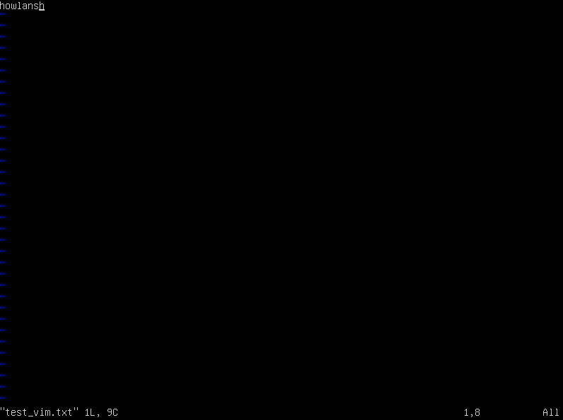
* Для выхода из Nano с сохранением нужно нажать комбинацию клавишь CTRL+X, затем ввести "Y" и нажать Enter.
* 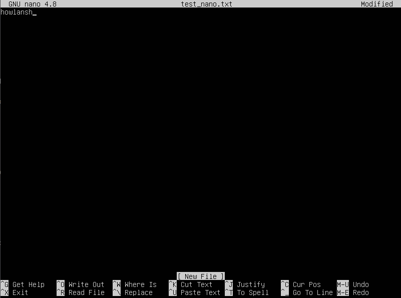
* Для выхода из MCEdit с сохранением нужно нажать Esc, выбрать Yes и нажать Enter.
* 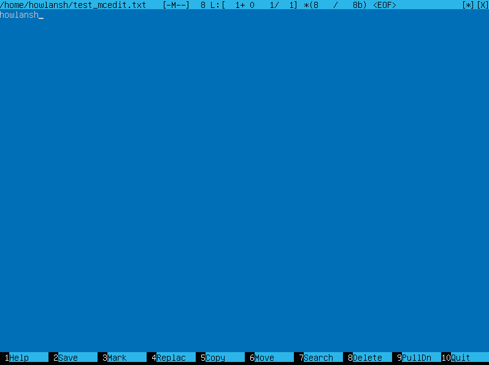
* Для выхода из Vim без сохранения нужно сначала нажать Esc, затем ввести с клавиатуры ":q!" и нажать Enter.
* 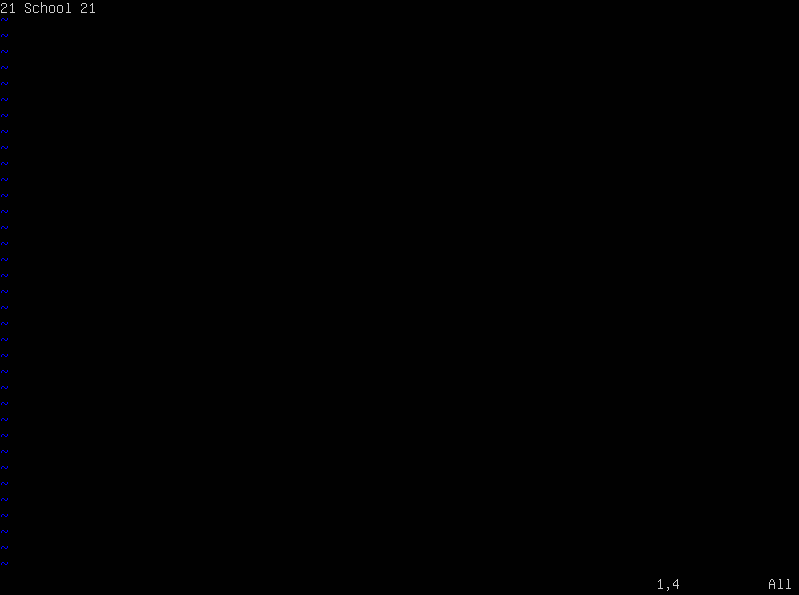
* Для выхода из Nano без сохранения нужно нажать комбинацию клавишь CTRL+X, затем ввести "N" и нажать Enter.
* 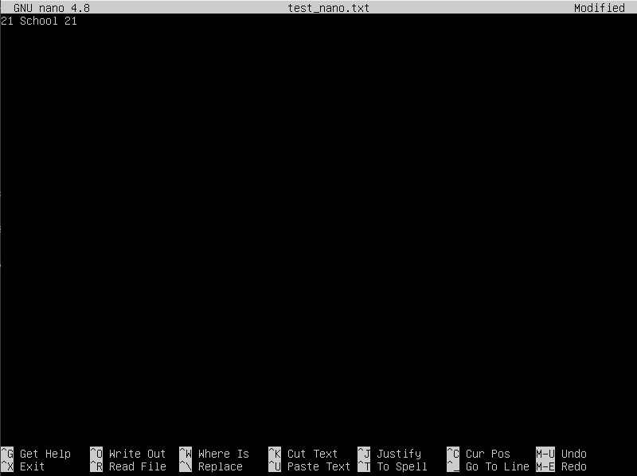
* Для выхода из MCEdit без сохранения нужно нажать Esc, выбрать No и нажать Enter.
* 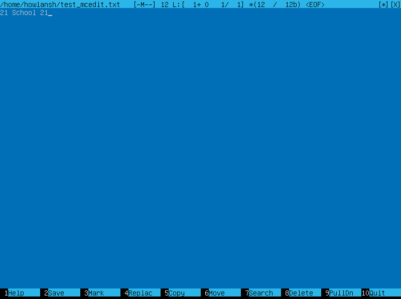
* Для поиска в Vim нужно ввести команду ":s/<искомое слово>".
* 
* Для замены слова в Vim нужно ввести команду ":s/<искомое слово>/<новое слово>".
* 
* Для поиска в Nano нужно нажать комбинацию клавишь CTRL+W и ввести искомое слово.
* 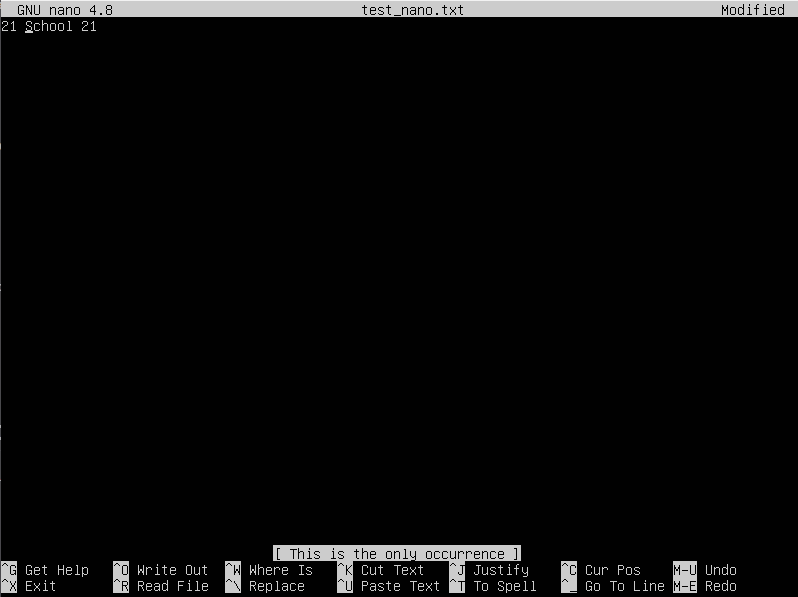
* Для замены слова в Nano нужно нажать CTRL+\\, ввести заменяемое слово и нажать Enter, ввести новое слово и нажать Enter, ввести "Y" и нажать Enter.
* 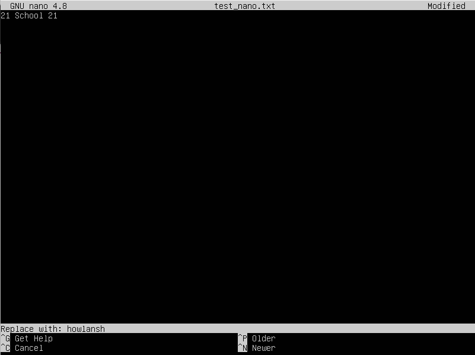
* Для поиска в MCEdit нужно передвинуть курсор в начало текстового файла, нажать F7, ввести искомое слово и нажать Enter.
* 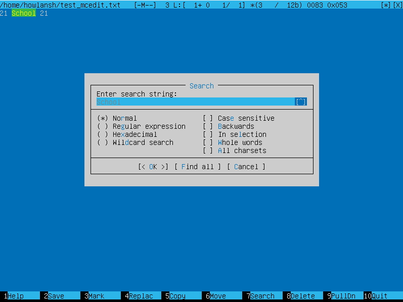
* Для замены слова в MCEdit нужно передвинуть курсор в начало текстового файла, нажать F4, ввести заменяемое слово, ввести новое слово и нажать Enter.
* 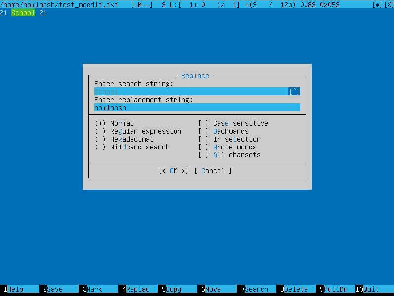

## Part 8. Установка и базовая настройка сервиса SSHD
* В параметрах команды apt указывается имя пакета ssh. Данная команда установит пакеты openssh-client и openssh-server одновременно.
* 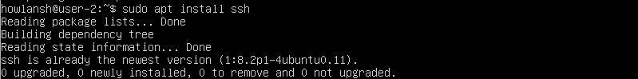
* Включаем автозапуск службы.
* 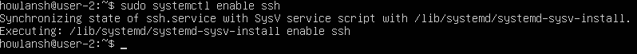
* В файле конфигурации меняем порт и раскомментим строчку.
* 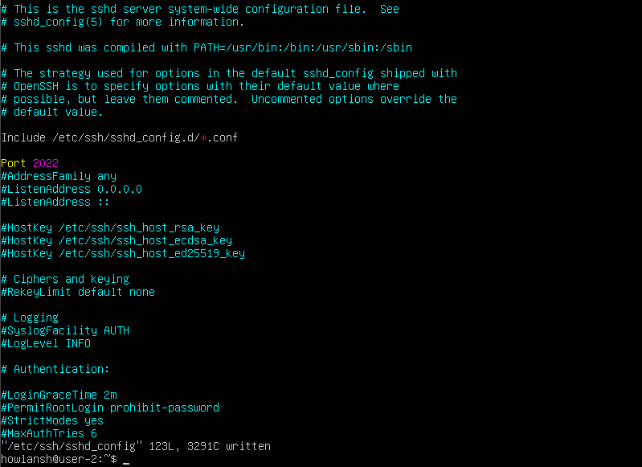
* Команда ps выводит список текущих процессов на вашем сервере в виде таблицы. Флаг -A или -e выводит все процессы, а командой grep отсортируем только включающие в название ssh.
* 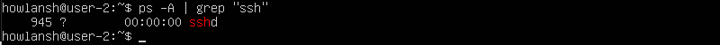
* Рестарт системы командой reboot.
* Netstat - выводит сетевые соединения, таблицы маршрутизации, статистику интерфейсов, NAT-соединения, и членство в мультикаст-группах. Опция "-t" показывает активные TCP соединения. Параметр "-a" также показывает сокеты, которые ждут соединения. Параметр "-n" показывать сетевые адреса как числа. Колонки: Proto - Протокол (tcp, udp, raw), используемый сокетом; Recv-Q - Счётчик байт не скопированных программой пользователя из этого сокета; Send-Q - Счётчик байтов, не подтверждённых удалённым узлом; Local Address - Адрес и номер порта локального конца сокета. Если не указана опция --numeric (-n), адрес сокета преобразуется в каноническое имя узла (FQDN), и номер порта преобразуется в соответствующее имя службы; Foreign Address - Адрес и номер порта удалённого конца сокета. Аналогично "Local Address"; State - Состояние сокета. Адрес 0.0.0.0 означает, что данный сокет прослушивает все доступные IP-адреса, которые есть на компьютере; когда компьютер имеет более одного IP-адреса, сокет может быть привязан только к определенной паре адрес и порт или к порту и всем адресам; если вы видите там IP-адрес, это означает, что сокет прослушивает только этот порт и этот конкретный адрес; если вы видите 0.0.0.0, это означает, что он прослушивает этот порт по всем адресам машины, включая адрес обратной связи (127.0.0.1).
* 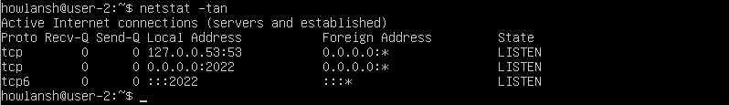

## Part 9. Установка и использование утилит top, htop
* Uptime - 1:52; количество авторизованных пользователей - 1; общая загрузка системы - 0.00, 0.04, 0.01; общее количество процессов - 120; загрузка cpu - 0%; загрузка памяти - 165,2MiB; pid процесса, занимающего больше всего памяти - 895; pid процесса, занимающего больше всего процессорного времени - 98.
* 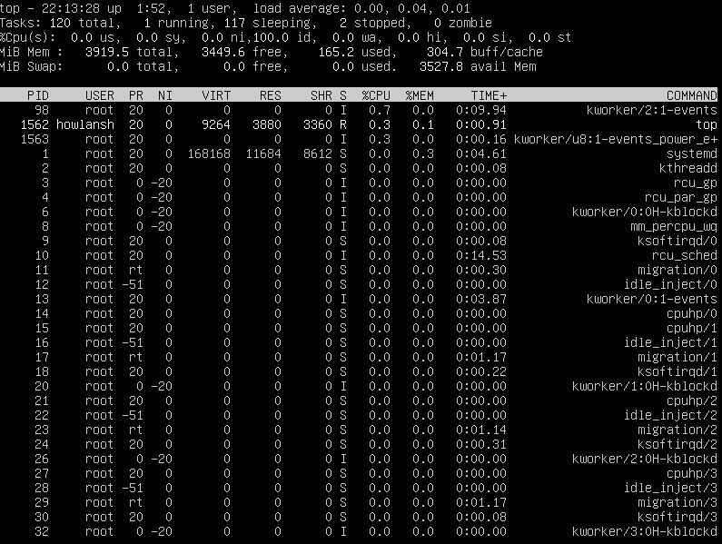
* Вывод команды htop отсортированный по PID.
* 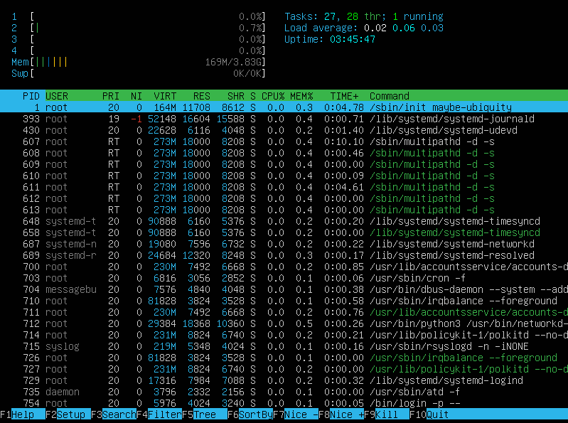
* Вывод команды htop отсортированный по PERCENT_CPU.
* 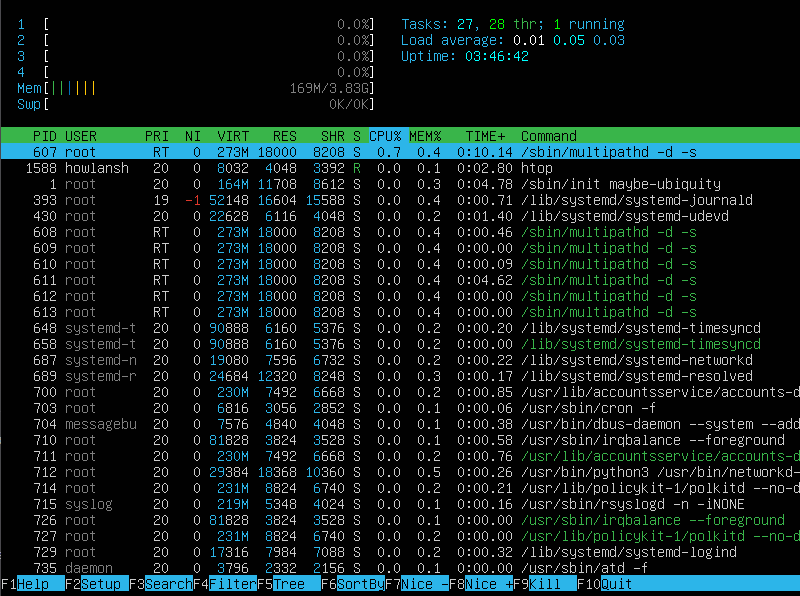
* Вывод команды htop отсортированный по PERCENT_MEM.
* 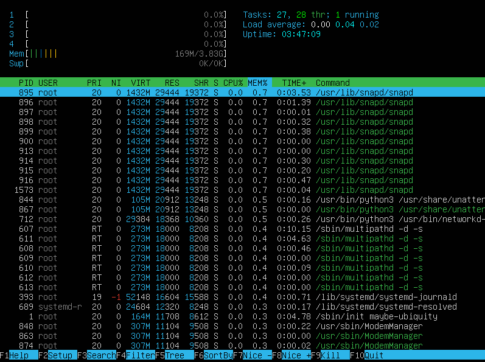
* Вывод команды htop отсортированный по TIME.
* 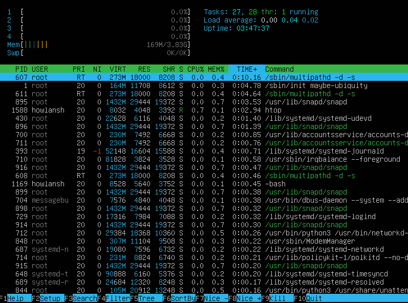
* Вывод отфильтрованный для процесса sshd.
* 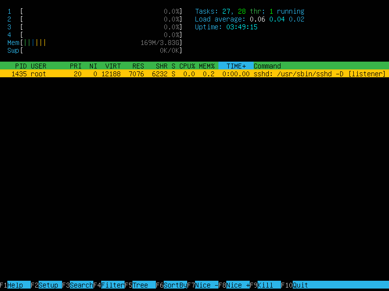
* Вывод с процессом syslog, найденным, используя поиск.
* 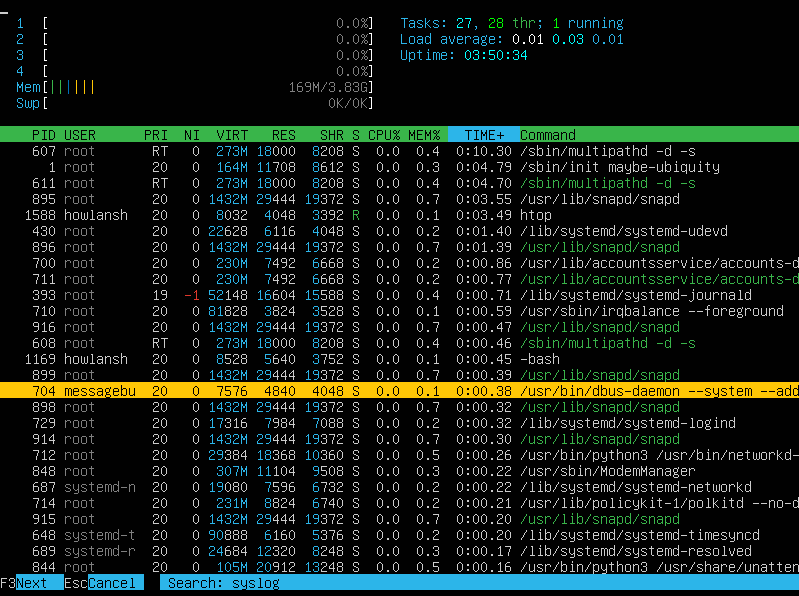
* С добавленным выводом hostname, clock и uptime.
* 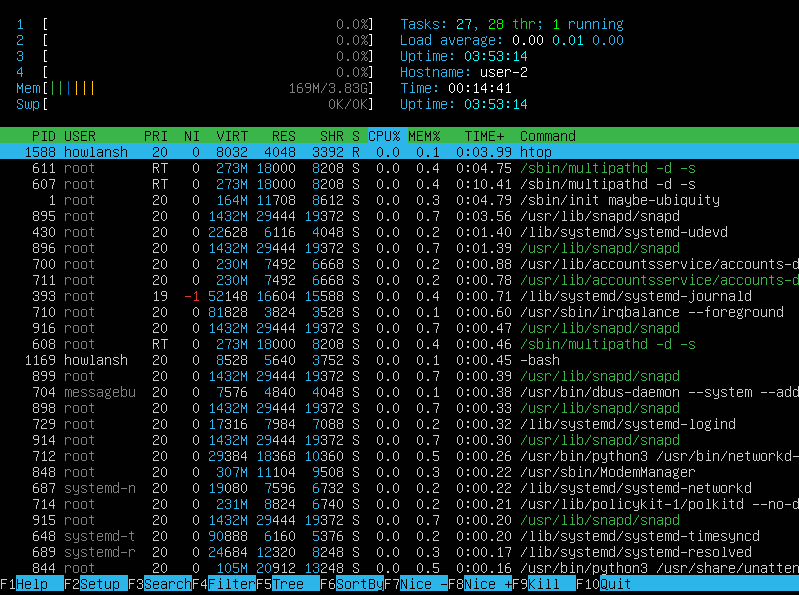

## Part 10. Использование утилиты fdisk
* Название жесткого диска - /dev/sda.
* Размер - 10GiB.
* Количество секторов - 20971520.
* Размер swap - 0B.
* Вывод команд "fdisk -l", "swapon --show", "free -h".
* 

## Part 11. Использование утилиты df
* 
* 

## Part 12. Использование утилиты du
* 
* 

## Part 13. Установка и использование утилиты ncdu
* 
* 

## Part 14. Работа с системными журналами
* 
* 

## Part 15. Использование планировщика заданий CRON
* 
* 