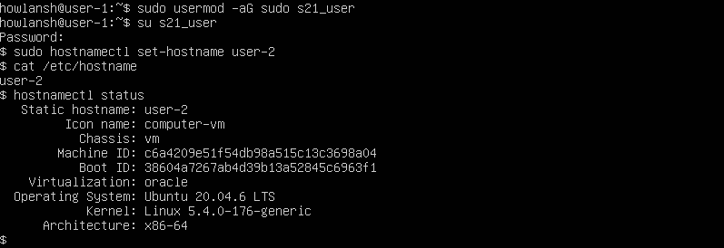

## Part 1. Установка ОС
* Вывод версии Ubuntu
* 

## Part 2. Создание пользователя
* Команда для создания пользователя
* 
* Вывод команды cat /etc/passwd
* 

## Part 3. Настройка сети ОС
* Имя машины можно задать командой "hostnamectl set-hostname user-1"  или редактировать название в файле "/etc/hostname".
* 
* Для установки часового пояса сначала находим нужный часовой пояс командой "tzselect", затем выбираем его командой "timedatectl set-timezone Europe/Moscow".
* 
* Вывод названия сетевых интерфейсоф командой "ip link show".
* 
* lo (loopback device) – виртуальный интерфейс, присутствующий по умолчанию в любом Linux. Он используется для отладки сетевых программ и запуска серверных приложений на локальной машине. С этим интерфейсом всегда связан адрес 127.0.0.1. У него есть dns-имя – localhost. Посмотреть привязку можно в файле /etc/hosts.
* IP адресс от DHCP сервера.
* 
* DHCP — протокол прикладного уровня модели TCP/IP, служит для назначения IP-адреса клиенту. Это следует из его названия — Dynamic Host Configuration Protocol.
* Внешний и внутренний IP  адреса шлюза.
* 
* Открываем файл конфигурации сети.
* 
* Отключаем DHCP и прописываем IP адреса вручную.
* 
* Применение настроек и перезагрузка системы.
* 
* Проверка настроек.
* 
* Пинг удалённых хостов.
* 

## Part 4. Обновление ОС
* Повторная команда для обновления не находит ничего нового.
* 

## Part 5. Использование команды  sudo
* 
* 
* sudo (англ. Substitute User and do, дословно «подменить пользователя и выполнить») — программа для системного администрирования UNIX-систем, позволяющая делегировать те или иные привилегированные ресурсы пользователям с ведением протокола работы. Основная идея — дать пользователям как можно меньше прав, при этом достаточных для решения поставленных задач. Программа поставляется для большинства UNIX и UNIX-подобных операционных систем. Команда sudo предоставляет возможность пользователям выполнять команды от имени суперпользователя root, либо других пользователей. Правила, используемые sudo для принятия решения о предоставлении доступа, находятся в файле /etc/sudoers (для редактирования файла можно использовать специальный редактор visudo, запускаемый из командной строки без параметров, в том числе без указания пути к файлу); язык их написания и примеры использования подробно изложены в man sudoers(5).

## Part 6. Установка и настройка службы времени
* 
* 

## Part 7. Установка и использование текстовых редакторов
* 
* 

## Part 8. Установка и базовая настройка сервиса SSHD
* 
* 

## Part 9. Установка и использование утилит top, htop
* 
* 

## Part 10. Использование утилиты fdisk
* 
* 

## Part 11. Использование утилиты df
* 
* 

## Part 12. Использование утилиты du
* 
* 

## Part 13. Установка и использование утилиты ncdu
* 
* 

## Part 14. Работа с системными журналами
* 
* 

## Part 15. Использование планировщика заданий CRON
* 
* 